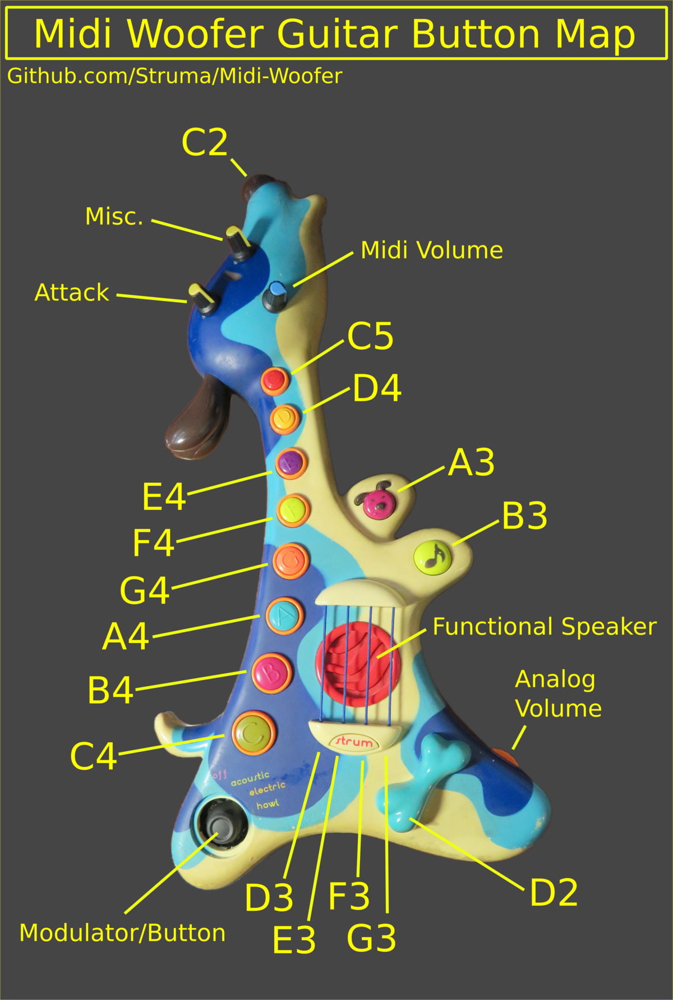
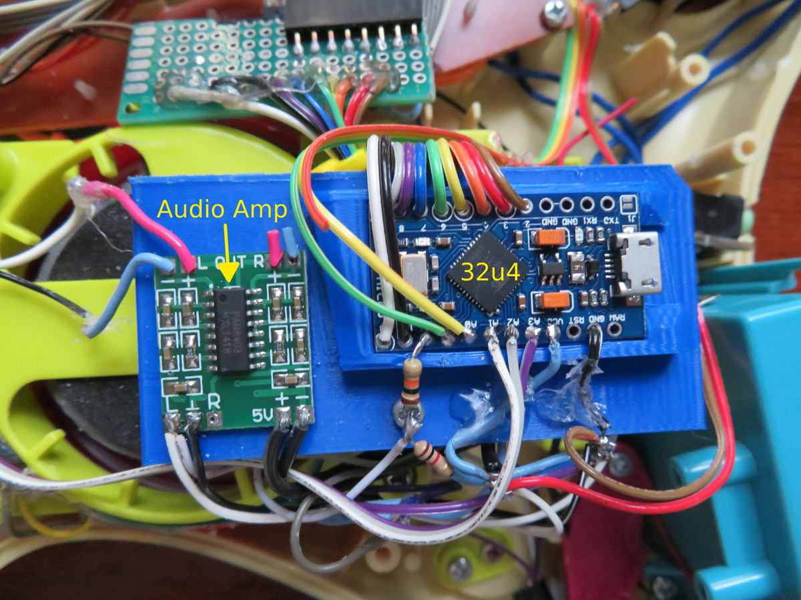

# Midi-Woofer
Converted Woofer guitar kids toy into a fun midi controller with amplifier!

Comes with custom Midipup library to make key mapping with MIDIUSB simple!

    
  

## A Dream Come True
It has been a lifelong dream of mine to hack together an instrument. I never imagined that I would make something so amazing. 

## Midi from the Amtel 32u4
Since I intially tried and failed to compile Vusb on the attiny85 I was looking for a better solution to create USB keyboards. Then I met the Amtel 32u4 which has USB support built in to a Nano v3 sized package. A while had past and I could eventually install Vusb on the attiny, but I was still dreaming about midi and the 32u4. Then opportunity showed itself.

  

## Ode to Hunter
A friend in college made an honest attempt to modify kids toys to use in music performances, not unlike the odd folk band Coco Rosie. A talented musician and artist, Hunter loved music and despite his lack of success using the toys (from what I remember), he was passionate in the way one can't help but respect. I thought of him while making this guitar and I'm satisfied that I made an instrument that does right by Hunter and those who dream.
